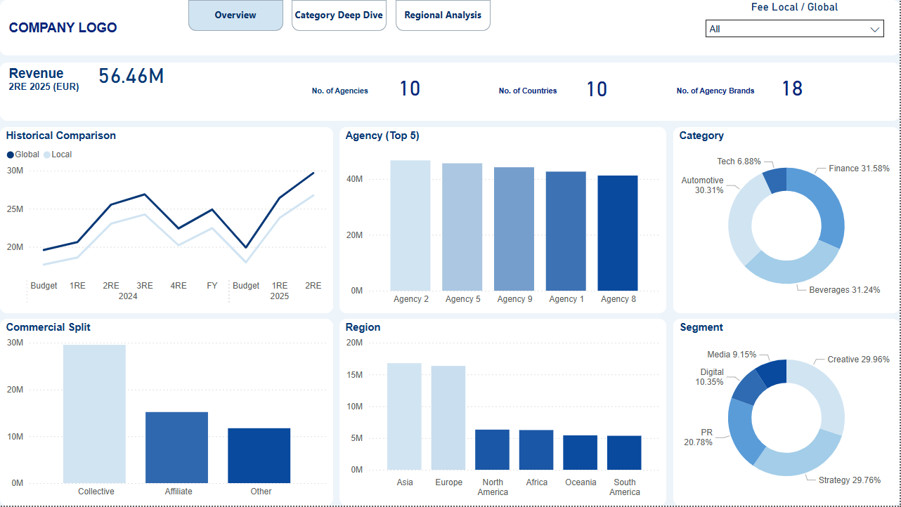
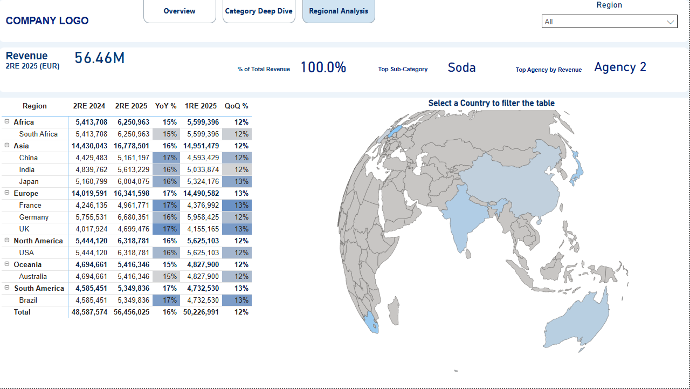

# 📊 Commercial Revenue Dashboard (Case Study)

**Power BI | DAX | Data Automation | Enterprise BI**

## 🔍 Overview

This project showcases a **custom-built internal revenue dashboard** designed for the commercial finance team at a global media agency. Previously, the team relied on a shared dashboard developed by our parent company, with limited flexibility, visibility, and relevance to our specific needs.

I initiated and led the end-to-end development of this dashboard to:

- Enable our commercial finance leads to own and explore their data
- Provide tailored insights for CFO-level reforecast presentations
- Improve the quarterly reporting cycle through automation and interactivity

This version uses **dummy data** for confidentiality but mirrors the structure and functionality of the live report used by senior stakeholders.

---

## 🧠 Business Context

Every quarter, commercial finance leads across our global agency present updated revenue forecasts to the Global CFO. However, the available reporting tools were too generic — developed externally, shared across multiple teams, and lacking custom analysis.

I created this dashboard to give our team full control over how we explore, analyse, and present our numbers. It’s now a central part of our quarterly reforecasting process and executive decision-making.

---

## 🛠️ Tools & Stack

- **Power BI (Desktop)**
- **DAX** for dynamic calculations
- **SQL** for structured data transformation (pre-model)
- **Folder-based ingestion logic** for version control
- **Bookmarks, tooltips, slicers** for UX

---

## 🧱 Data Model

A star schema was built to organise and relate the data efficiently. The dummy dataset emulates the original, with relevant dimensions and fact tables.

---

## 📈 Dashboard Breakdown

### **Page 1: Overview**

A high-level snapshot of performance by multiple business angles.

**Features:**
- Cards: Number of agencies, countries, agency brands
- Line chart: Historical revenue trend
- Column chart: Top 10 agencies by revenue
- Donut chart: Revenue by business category
- Column chart: Revenue by commercial split
- Column chart: Revenue by region
- Donut chart: Revenue by segment
- Page slicers: Fee Local / Global
- Navigation: Bookmark buttons for page switching
- Tooltips: Custom tooltip pages for visual interactivity

---

### **Page 2: Category Deep Dive**

Focused view on revenue by business category and sub-category.

**Features:**
- Cards: % of total revenue, top sub-category, top country
- Tree map: Revenue by sub-category
- Bar chart: Sub-category x region matrix
- Column chart: Revenue by agency
- Line chart: Historical revenue trend
- Column chart: Revenue by region
- Page slicers: Category
- Navigation as on other pages

---

### **Page 3: Regional Analysis**

Region-first view with growth metrics and visual mapping.

**Features:**
- Cards: % of total revenue, top sub-category, top agency
- Table: YoY % growth and QoQ % growth, broken down by region and country
- Shape map: Global revenue visualised by country
- Page slicers: Region 
- Interactive navigation included

---

## 🧮 Key Metrics (via DAX)

Custom DAX measures power all dynamic KPIs and visuals:

- Revenue for latest reporting period
- Percentage of total revenue (by region/category)
- Year-over-Year (YoY) and Quarter-over-Quarter (QoQ) growth
- Top agency / sub-category / country logic
- Dynamic date comparisons for accurate benchmarking

---

## 🔁 Automation Features

- Folder-based ingestion logic allows new report versions to be uploaded quarterly
- Version control prevents duplicate data from being included
- DAX-based dynamic filtering and comparison logic enables efficient period analysis

---

## 🔗 Files & Access

- [Dummy Dataset](data/dax_measures.md) – Dummy dataset  
- [Power BI Report (.pbix)](Global_Revenue_BI_Report.pbix) – Interactive report  
- [DAX Measures](docs/dax_measures.md) – DAX Measures used across the BI report

---

## ✅ Outcome

This dashboard:

- Replaced an inflexible, externally built tool
- Gave our commercial finance team full control over analysis
- Became central to our CFO-level reporting and reforecast process
- Improved data transparency and reduced manual reporting time

---
